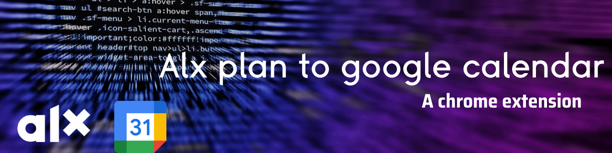
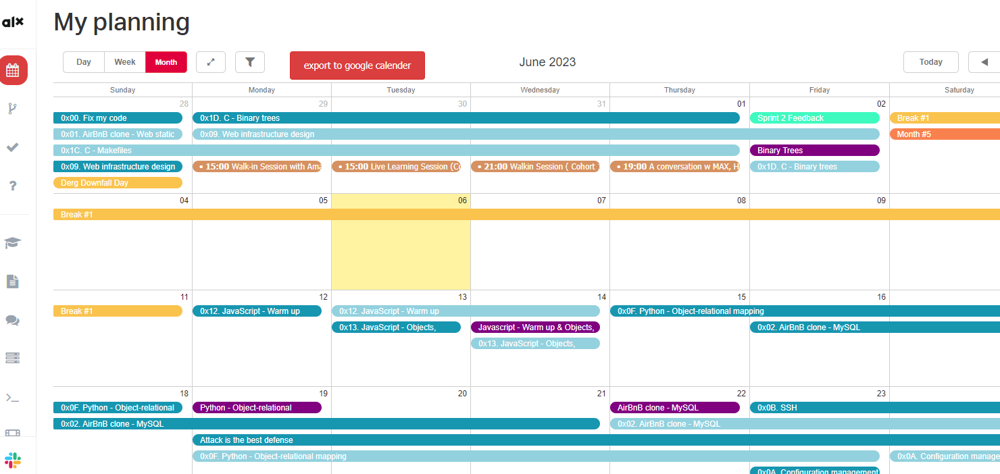

# Alx-plan-to-google-calendar
This is a Chrome extension that allows you to easily import calendar schedules from Alx into your Google Calendar. With this extension, you can synchronize your Alx schedules with your Google Calendar, ensuring that you never miss an important event.

## Table of Contents
- [Alx-plan-to-google-calendar](#alx-plan-to-google-calendar)
  - [Table of Contents](#table-of-contents)
  - [Installation](#installation)
  - [Usage](#usage)
  - [Contributions](#contributions)
  - [License](#license)
  - [Disclaimer](#disclaimer)
  - [Contact](#contact)
  - [contributors](#contributors)

## Installation

1. Download the latest release of the extension from the [releases page](https://github.com/MelakuDemeke/Alx-plan-to-google-calendar/releases).

2. Unzip the downloaded file to a location on your computer.

3. Open Google Chrome and go to `chrome://extensions`.

4. Enable "Developer mode" using the toggle switch in the top right corner.

5. Click on the "Load unpacked" button and select the folder where you unzipped the extension.

6. The extension should now be installed and ready to use.

## Usage

1. Navigate to your Alx schedule page.

2. Click on the the button `export to google calender` that is render beside the filter buttons

3. it will open a modal with all schedules and all you need to do is add the schedule you want

## Contributions

Contributions are welcome! If you would like to contribute to this project, please fork the repository, make your changes, and submit a pull request.

## License

This project is licensed under the [MIT License](LICENSE). Feel free to modify and distribute the extension as per the terms of the license.

## Disclaimer

This extension is not affiliated with Alx or Google. Use it at your own risk. The extension author takes no responsibility for any data loss or other issues that may occur while using this extension.

## Contact

If you have any questions, suggestions, or feedback, you can reach me at [MY Git Page](https://github.com/MelakuDemeke)

---

Thank you for using the Alx Calendar to Google Calendar Chrome extension! We hope it helps you stay organized and manage your schedules effectively.

## contributors
